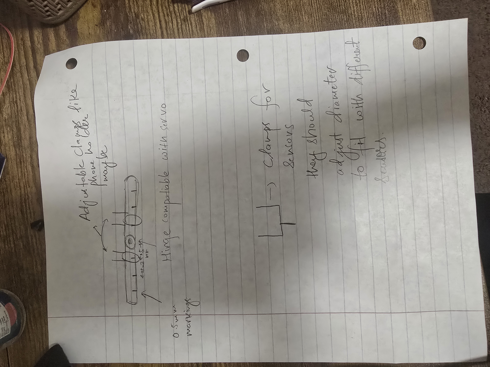

# HAPTIC GLOVE

A smart glove which tracks hand and finger movement. This movement could be used for variety for tasks such as gaming, physics simulations and hand controlled robots.

## Current Development Stage

Design/Planning stage.

## Important Updates

- We're now working with a lab (Controls Systems) to use our glove as an input for their robotic arm. The lab is trying to find optimal way to represent a grab. They'll use our data as features for their model. We're also adding extra pressure sensors to accomodate their goal of researching optimal grab function/model.
- We're using ESP32 for prototyping purposes as it is faster to write new code and get started with. It is also decently fast for our purposes as well as has in built bluetooth module.
- We've tested the [A1324LUA-T](https://www.allegromicro.com/en/products/sense/linear-and-angular-position/linear-sensors-1d/a1324-5-6) sensor.
- I have re-ordered the [N35](https://www.digikey.com/en/products/detail/radial-magnets-inc/8193/555328?s=N4IgTCBcDaIDoBcAEg4AgCwDYCcBaAjAAwFo4ByAIiALoC%2BQA) magnets.
- I also ordered the [Accelerometer](https://www.digikey.com/en/products/detail/adafruit-industries-llc/3886/10709725) sensor. This would be used to track the hand position and orientation of it. It communicates with the I2C protocol.
- Additionally, I got 5 [Potentioemeter](https://www.digikey.com/en/products/detail/tt-electronics-bi/P091S-FC20BR10K/2408860). These would be used to measure the bend on the knucle of each hand. I chose this idea so we could combine readings from nultiple sensores i.e Hall Effect and Potentiometer to eliminate any noises or irregularities in sensing data. Also, I think multi-sensor sensing is always safer and better choice for a project.

## TODO Tasks

While I'm providing a starter information on each of these, remember to do your own reasearch and point out anything stupid I might have included. Also, feel free to go beyond the points include things you find are better or needed for this project.

This must be a group effort!!!

- [ ] Calibrate Sensors
    - Hall-Effect Sensors: We'll be CADing a two arm hinge design to turn the joint at several angles and then measure the sensor output at that point. We'll using a servo to turn the hinge at several outputs and store the mappings of sensor value at that angle. I'm attaching a design for it. We need adjustable placeholder clamps so we can fit sensors of different dimensions on it. Another good design principle would be to make 0.5mm indentation marks on the arms so we can asjust it to different distances while testing. Also make sure the hinge hole is compatiable with the servo motor using. I'll be writing the software code this break helpful in capturing the data and rotating servo. After collecting the data, we'll need to use linear regression/ML model to create a function that best fits our test angles with the captured sensor reading. Here's the idea sketch of my design: 

    - Potentiometer: Pretty much same as Hall Effect sensors but use potentiometer on one arm and stick your spool/spring/tape to other arm at appropriate distance. [Here's](https://www.youtube.com/watch?v=1ZJNX8JCDOc) a good example on how our spool could look like. You can come up with some newer and interesting designs as well if you can!

    - Gyroscope and Acceleromoter: The good thing is we don't need to fit in/process our sensor data for this one. The raw data should be good as long as sensor is calibrated good enough. You can turn your hand into a circle in 3 different planes and map the two axes data of those plane. They should also form a circle is sensor is calibrated good enough. For gyroscope reading, rotate it at a constant torque and you should get almost constant value for that axis if calibrated right.

- [x] Select a MCU and Bluetooth Serial
    - A Lightweight development board with space constraints as well as low power consumption.
    - A Bluetooth Serial module to communicate with the host computer (your Laptop). This would not be needed if using boards like ESP32 which have bluetooth antenna built in.

- [x] Select sensors to sense the finger movement and hand tracking/orientation.
    - There are quite some options for finger movements. Try to compare benefits and disadvantages of each:
        - Hall Effect Sensor
            - Would be small and streamlined
            - Very cool
            - Hall effect sensors could interfer with other Hall effect sensors nearby (would need to test various magnet strengths)
            - Would need to be calibrated in order to output accurate distance readings
            - Potentially good options: [Hall-Sensor](https://www.allegromicro.com/en/products/sense/linear-and-angular-position/linear-sensors-1d/a1324-5-6)
            - Thing to consider:
                - This is a linear sensor so voltage changes linearly with the field.
                - Field usually is proportional to 1/r^3. How would you translate this voltage to possible distance or bend of the finger?? Maybe some kinda linear or quadratic fit could work.
                - What magnets to use and how would orientation of the magnets affect strength.
                - Also consider the our finger curl would majorly not be in a single axis. How important would this fact be as we would bend our joints in almost 90 degrees.

        - Potentiometer
            - Probably the most reliable option
            - Would need some way to mechanically turn potentiometer with finger movement
            - Not as cool as Hall effect sensors
            - Potentially good option: [Potentiometer](https://www.digikey.com/en/products/detail/tt-electronics-bi/P091S-QC15BR50K/2408861?gclsrc=aw.ds&gad_source=1&gad_campaignid=20243136172&gbraid=0AAAAADrbLljAaYyrH2StYB2OtgEJ8E_fF&gclid=CjwKCAiA9aPKBhBhEiwAyz82J6oq35BpvMt4HSuEcbuBFEe52bV97d_MmbQ3v2_BS-f8GoTKQrzsoRoCMi0QAvD_BwE)
        - A Flex sensor
            - Would be the smallest option (could be put inside of or even woven into glove)
            - Known to be unreliable and difficult to work with

    - The hand tracking might require some sophisticated sensor. Possible a combination of gyroscope and accelerometer. I'm not quite sure (would appreciate if someone does deep research on this).
    - Based on the selection of the sensor, you'd have to figure if a custom PCB is needed or an overkill for this. Try to talk with person selecting the MCU as he'd know what connections are neccessary.

- [ ] Select a simulation software to convert our sensor information into something tangible on the host screen. There might be a lot of physics simulation softwares. Main task would be to find how to interact with it. You can build your own simulation as well if you feel (but i won't recommend as it is not worth rn). This is the least in priority rn as we're just using the data for robotic arm from lab now. Someone could talk to the lab supervisor and get to know what form of data it wants.

- [ ] Try to document the process so we can just keep a record of what's happening. You can update this doc explaining your decision and why you choose one thing over other. Overall, just keep everyone in the team updated to make sure all of us have equal understanding and ownership of this thing
